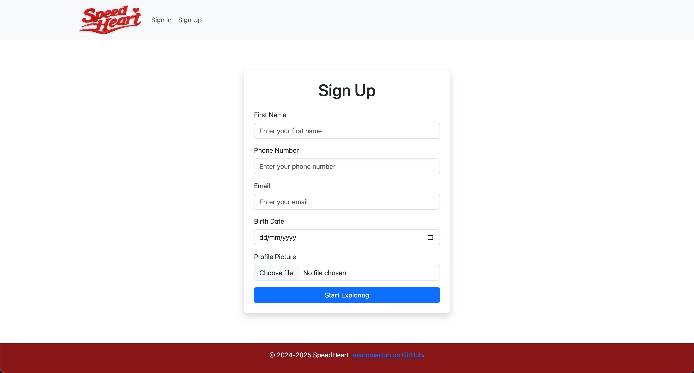
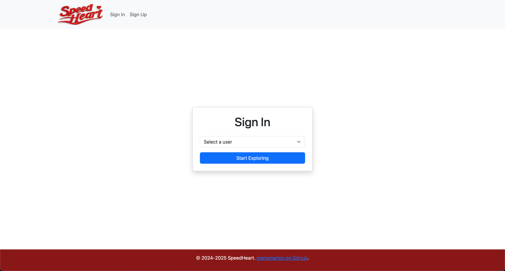
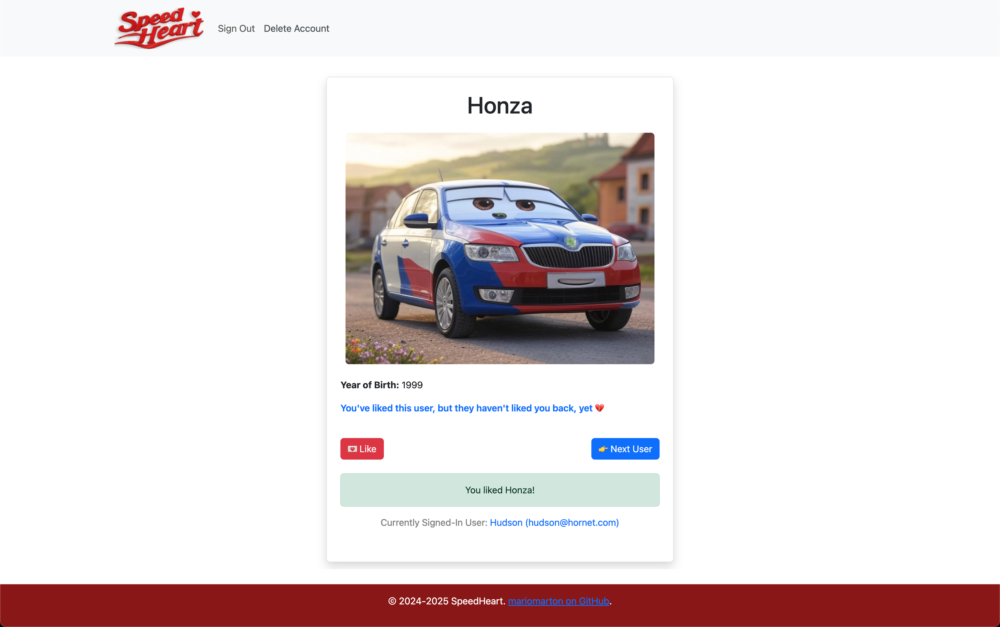
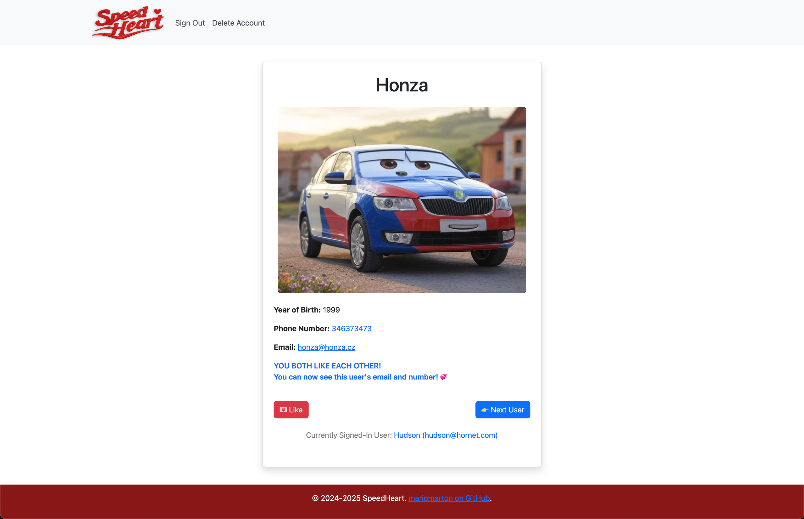
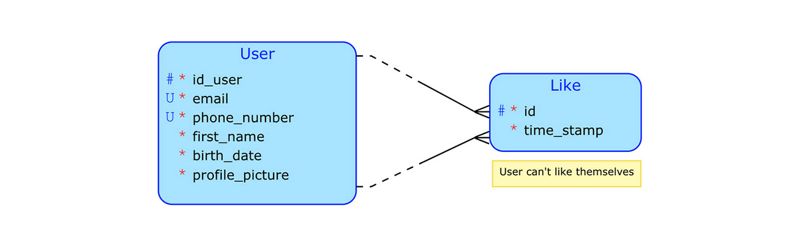
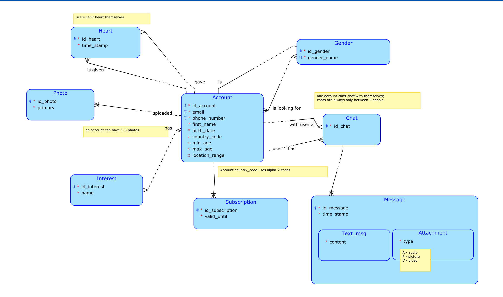

# SpeedHeart

SpeedHeart is a prototype dating web app built using Java, Maven, Spring Boot, JPA, and Thymeleaf. It allows users to create and delete profiles, view other users' profiles from a different user's perspective, and engage in a "like" system with correlated logic.

The idea behind this app was to create a dating platform for various animated car characters (hence the name SpeedHeart). However, it can also be used by humans or any other beings! :)

## Running the App and Tests

You can easily run the app with the included Maven wrapper. Simply execute one of the following commands:

- `./mvnw spring-boot:run` on macOS/Linux
- `mvnw.cmd spring-boot:run` on Windows

After executing the command, the application should be available at [http://localhost:8080](http://localhost:8080).

To run the tests, use the test command:
- `./mvnw test` on macOS/Linux
- or `mvnw.cmd test` on Windows

## Overview of the front-end

**1. Sign Up page:** The sign-up page allows users to create an account, including uploading a profile picture. Data validation is applied to ensure correctness.

**2. Sign In page:** Users can sign in by selecting a previously registered account. Currently, this implementation does not require authentication and passwords are not handled in the application.

**3. Browse Other Users:** Once signed in, users can browse through other profiles and give them likes. Users can see whether they've liked a particular account and whether the account has liked them back. When the like is mutual, contact information is shared between the two users. If a user receives a mutual like from another, their contact information is revealed, as shown in the image below. The currently signed-in user's account is also visible, and they can sign out or delete their account directly from the navigation bar.

## Conceptual Schema

The current implementation is based on this simplified conceptual schema. However, earlier, I designed a more comprehensive conceptual schema, which could be used for future expansions of SpeedHeart. This schema is shown below.

## Full Conceptual Schema

This older schema may contain some inaccuracies, so please take it with a grain of salt.

## Copyright Information

The user image shown in this README is purely an example of a potential profile picture that a user might upload. It is for illustrative purposes only. The SpeedHeart application does not provide profile pictures; users are free to upload any image of their choice. The same applies to displayed names, email addresses, and other user information.

